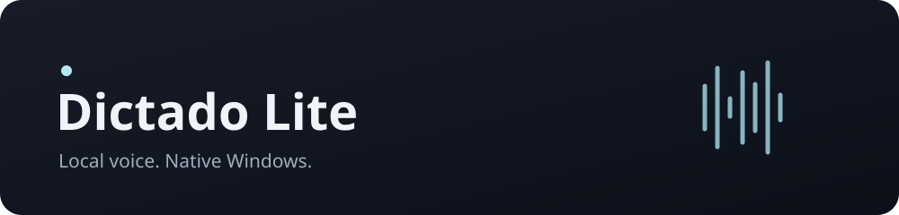
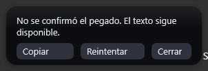

**Speak. Release. Keep writing.**

Local Parakeet recognition · Native Windows controls · Your voice stays here

Dictado Lite is a small Windows dictation app: hold **Ctrl+Alt+Space** to speak,
release it to insert text where you are writing. A quiet tray menu and a tiny
microphone pill are its everyday interface. **Escape** cancels.

The native Windows x64 installer contains the application, one Parakeet Q8_0
model and all notices. Run `Dictado-Lite-0.1.0-Setup.exe`, install for your user and
open Dictado Lite from Start. It works offline with Vulkan acceleration and CPU
fallback. No Handy, Node, Python, CUDA or browser runtime is required.

[Download Windows x64 installer](https://github.com/dean6609/dictado-lite/releases/download/dictado-v0.1.0/Dictado-Lite-0.1.0-Setup.exe)
· [SHA-256](https://github.com/dean6609/dictado-lite/releases/download/dictado-v0.1.0/Dictado-Lite-0.1.0-Setup.exe.sha256)
· [Installation details](docs/installer.md).
Downloads require access to this private repository; the installed app needs no account.

The microphone drives the bars. On a paste failure, the result stays available:

These are isolated captures of the real executable in its developer inspection
shell mode. Normal use adds no taskbar window. See [measured UI checkpoint](benchmarks/native-pill-2026-10-08.md).

The tray controls dictate/stop, pause/resume, microphone, shortcut, optional basic
cleanup and optional Windows startup (off by default). There are no accounts,
model catalog or transcript history. Audio stays in memory during a session.
Cleanup uses conservative Spanish/English rules; it does not translate or guess
misrecognized words and can be switched off.

Real WAV insertion and focus recovery in Notepad match the accepted Parakeet
baseline. Installation, upgrade, uninstall, dependency isolation and CPU fallback
have been exercised on Windows. Live spoken input is deferred by the user;
browser insertion, additional physical monitors and accessibility-theme checks
remain pending. See [verification](docs/verification.md) and the numeric
[engine](benchmarks/core-2026-10-08.md), [cleanup](benchmarks/cleanup-2026-10-08.md)
and [installed-app](benchmarks/installed-app-2026-10-08.md) measurements.

For contributors: [Build & contribute](CONTRIBUTING.md) ·
[Architecture](docs/architecture.md) · [Verification](docs/verification.md) ·
[Provenance](docs/provenance.md) · [AI guide](AGENTS.md).

Derived from Handy under [MIT](LICENSE). NVIDIA Parakeet weights use CC BY 4.0;
see [model attribution](models/manifest.json) and [third-party notices](THIRD_PARTY_NOTICES.md).
