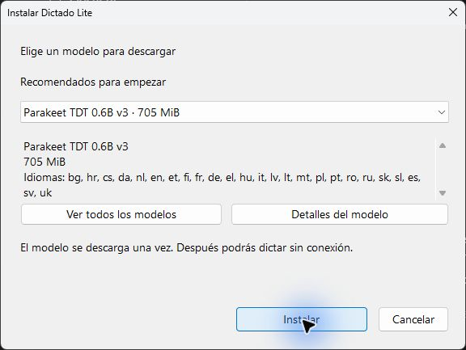
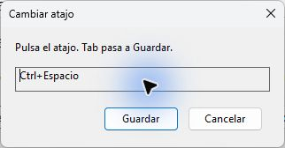

# Dictado Lite

**Tu voz, directamente donde escribes.**

[Descargar para Windows](https://github.com/dean6609/dictado-lite/releases/latest) · [Instalación](docs/installer.md) · [Contribuir](CONTRIBUTING.md)

Pulsa **Ctrl+Espacio** para empezar, habla y pulsa de nuevo para insertar el texto. **Escape** cancela.
Una pequeña barra indica la actividad del micrófono y un menú en la bandeja
reúne los ajustes. El reconocimiento se ejecuta en tu equipo.

## Empieza en tres pasos

1. Descarga el archivo **Setup.exe** del release e instala para tu usuario.
2. En el mismo instalador, descarga **Parakeet v3**, el recomendado, o elige un
   modelo. Primero verás recomendados; puedes abrir la lista completa.
3. Coloca el cursor donde quieres escribir y pulsa **Ctrl+Espacio**. Pulsa otra vez para terminar.

El setup no lleva modelos preinstalados: los descarga durante la instalación.
Solo necesitas Internet para descargar un modelo. Después puedes dictar sin
conexión, sin cuenta ni suscripción. Los modelos se guardan separados de la
aplicación y se reutilizan al actualizarla. La versión publicada 0.1.0 incluye
el modelo; la instalación ligera corresponde a la siguiente versión 0.1.1.

## La aplicación, tal como es

| Instala solo lo necesario | Elige cómo reconocer tu voz |
| --- | --- |
|  |  |

Las capturas muestran ventanas del ejecutable real. La barra de escucha se
capturó en modo de inspección; el uso habitual no añade una ventana a la barra
de tareas. No se utilizan maquetas del programa.

## A tu manera

- **Atajo editable:** Ctrl+Espacio de inicio; también admite otras combinaciones.
  Los atajos guardados de instalaciones anteriores se conservan.
- **Micrófono seleccionable:** predeterminado de Windows o un dispositivo concreto.
- **Idioma del sistema:** interfaz en español o inglés según el idioma de Windows;
  los demás idiomas utilizan inglés por ahora.
- **Modelos de Handy:** recomendados al principio y un botón para abrir el catálogo completo.
  Puedes cambiarlo desde **Modelos…** en la bandeja.
- **Controles sencillos:** pausar, limpieza básica opcional e inicio con Windows.
- **Recuperación del texto:** si cambia el destino o falla el pegado, puedes copiar
  el resultado desde la barra o la bandeja.

Soltar el atajo mantiene la grabación. Una segunda pulsación la termina.
Dos pulsaciones separadas por menos de 250 ms se descartan sin error. Si hablas y no aparece texto,
comprueba el dispositivo en **Micrófono** y que las barras respondan a tu voz.

## Privacidad y requisitos

Windows x64. Vulkan cuando está disponible, con respaldo por CPU. No necesitas
instalar Handy ni un navegador integrado. La descarga de pesos se realiza desde
Hugging Face; el audio y el reconocimiento permanecen en tu equipo. La aplicación
no guarda grabaciones ni historial de transcripciones.

El espacio, memoria, idiomas y rendimiento dependen del modelo elegido. El
recomendado ocupa aproximadamente 705 MiB; los modelos grandes requieren más
recursos. Consulta los [resultados verificados y sus límites](docs/verification.md).

## Modificar y contribuir

El proyecto utiliza **GitHub Flow**: rama corta, cambios revisables, verificaciones
y pull request a `main`. [CONTRIBUTING.md](CONTRIBUTING.md) contiene los comandos.
[AGENTS.md](AGENTS.md) orienta a asistentes de programación;
[arquitectura](docs/architecture.md) explica los módulos y sus contratos.

## Licencias y créditos

El código de Dictado Lite es [MIT](LICENSE), derivado de
[Handy](https://github.com/cjpais/Handy). Se conservan sus atribuciones y las del
motor transcribe.cpp, ggml y las dependencias en [NOTICE](NOTICE) y
[avisos de terceros](THIRD_PARTY_NOTICES.md).

Los pesos tienen **licencias propias**. Parakeet v3 es CC BY 4.0: NVIDIA es el
autor del modelo y handy-computer realizó la conversión GGUF y cuantización.
Otros modelos pueden tener términos distintos. Puedes consultar sus términos
en la página de origen desde «Detalles del modelo». No se incluyen pesos en el setup nuevo.
