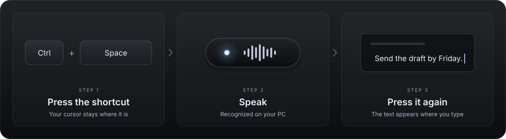

**Type with your voice in any app on Windows.** 
Press a shortcut, speak, and your words appear where your cursor is. 
Everything runs on your PC — no account, no subscription, nothing stored.

[How it works](#how-it-works) · [Install](#install) · [Models](docs/models.md) · [Contributing](CONTRIBUTING.md)

## How it works

1. Click where you want to write — an email, a document, a chat.
2. Press **Ctrl + Space** and speak. You can let go of the keys.
3. Press **Ctrl + Space** again. Your words are typed in.

Press **Esc** to cancel. Everything else — shortcut, microphone, model —
lives in the tray icon next to the clock.

## Install

1. Download **Dictado-Lite-0.1.1-Setup.exe** from the [latest release](https://github.com/dean6609/dictado-lite/releases/latest).
2. Run it and pick a speech model. The recommended one works well for most
   people; you can switch later.
3. Open any app and press **Ctrl + Space**.

Setup downloads the model once (about 705 MiB for the recommended one). After
that, recognition works offline. No administrator rights are needed.

> [!NOTE]
> The installer is not code-signed yet, so Windows may show a SmartScreen
> warning. Choose **More info → Run anyway** to continue.

## What you get

|  |  |
| --- | --- |
| 🔒 **Private** | Your voice is processed on your PC and never saved. Internet is only used to download models. |
| 🪶 **Light** | A ~55 MiB native app with a tiny indicator and a tray menu. The model is unloaded when you stop using it. |
| 🎛️ **Yours** | Change the shortcut, microphone and model. Optional text cleanup and start with Windows. |
| 🛟 **Safe** | If the window changed or the text could not be typed, copy it from the indicator or the tray. |
| 🌐 **Bilingual** | The interface follows your Windows language: English or Spanish. |

**Requirements:** Windows x64. A graphics card with Vulkan makes recognition
faster, but the CPU works too. Memory, speed and supported languages depend on
the model you choose — see [available models](docs/models.md).

## Build it yourself

Clone the repository and build everything on your own computer — no special
access or cloud service required. [CONTRIBUTING.md](CONTRIBUTING.md) has the
commands, and the [architecture map](docs/architecture.md) explains how the
pieces fit. Coding assistants should start with [AGENTS.md](AGENTS.md).

## License and credits

Application code is [MIT licensed](LICENSE) and derived from
[Handy](https://github.com/cjpais/Handy), using the native transcribe.cpp / ggml
engine. Original attribution is kept in [NOTICE](NOTICE) and the
[third-party notices](THIRD_PARTY_NOTICES.md).

Speech models are downloaded separately and keep their own licenses. The
recommended NVIDIA Parakeet v3 model is CC BY 4.0, converted to GGUF by
handy-computer. No model weights are included in the installer.
