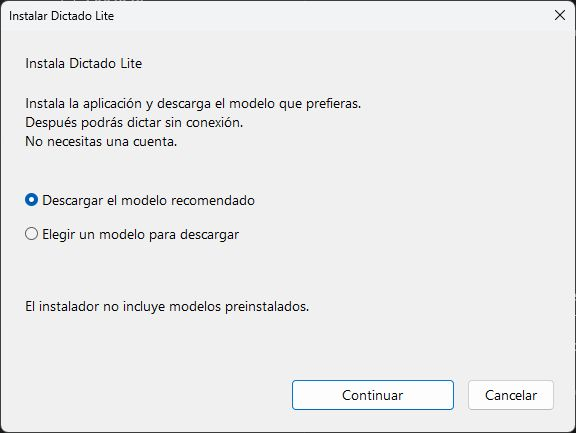

# Lightweight Windows installer

The native setup installs the application and its runtime, without model weights.
It offers two options: download the recommended model, or choose from the GGUF
catalog. Choice, model selection, installation/download progress and completion
replace the content of one centered window. The selector starts with recommended
models and offers the full catalog on request. The dialog uses Windows system
colors consistently. Startup with Windows remains optional.



Installation belongs to the current user in `%LOCALAPPDATA%/Programs/DictadoLite`.
Setup creates a Start Menu shortcut and an HKCU uninstall entry. No administrator
rights, Handy installation or web runtime are required. Settings and downloaded
models live separately in `%LOCALAPPDATA%/DictadoLite` and survive uninstall.

Every embedded application file is checked against the bounded payload manifest.
Models are refused in new installer payloads. Relative paths reject traversal,
reserved device names, duplicates and reparse ancestors. Upgrade moves only
previously owned files and rolls them back if publication fails. Uninstall removes
only manifest-owned files and empty directories, preserving unexpected files.
The model is prepared before changing an existing installation. Verified weights
from 0.1.0 are reused in the separate cache before their old bundled copy is removed; models downloaded
by the new application remain in its separate cache.

Model downloads use Windows HTTPS networking on a worker, not the UI thread.
Each catalog entry pins its source revision, size and content hash. A partial
file never reaches inference; cancellation or failed verification discards it.
Verified weights are atomically published. Connection failures leave the setup or model picker open for retry. Only downloading needs Internet. Existing Handy settings
and caches are not migrated or changed.

The application and setup follow Windows' display language: Spanish or English,
with English fallback for other locales. This does not force transcription into
the interface language. Models requiring a language hint prefer a supported
interface language, then English, then their first supported language; models
with detection receive no forced language hint.

Build after the native release checks:

```powershell
./scripts/build-installer.ps1
```

The output is `artifacts/Dictado-Lite-0.1.1-Setup.exe`. No model argument or separate
checksum download is required. Internal payload and model checks remain enabled.
The executable is currently unsigned.

Packaging includes MIT provenance, engine/ggml/miniz notices, LLVM and MinGW
runtime notices, resolved Rust dependency license texts and Rust standard library
notices. Metadata and CC BY terms for the recommended model are included, but no
weights. Other models retain separate terms on their source pages. A model's
license is not the application's MIT license.

Consumer packaging uses GNU x64; MSVC CI validates both native binaries.
`--quiet --test` installs into a fixed separate `DictadoLite-QA` directory without
registry/shortcuts or changing normal preferences. The same extraction and
ownership checks apply there. Keep physical installation/UI evidence separate
from compilation and record any untested environment.
